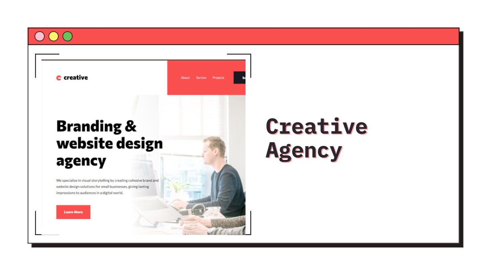
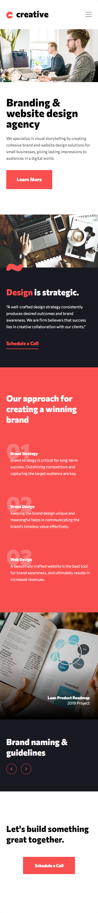
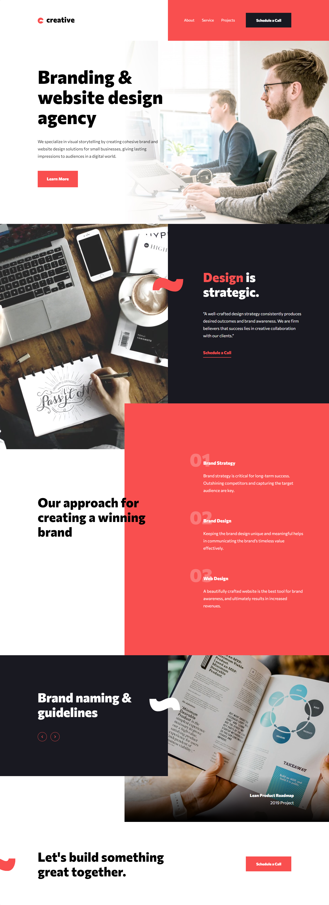

<h1 align="center">Creative agency single-page site
</h1>

<div align="left">

</div>

&nbsp;



<h2 align="center"> 
	🚧 Creative agency single-page site 🟢 Completed 🚀 🚧
  
</h2>

&nbsp;

<!--
## Table of contents

- [Project description](#description) - [What I learned](#What-I-learned) -->

<h2 id="#description">Project description 📚</h2>

This is a solution to the challenge
[Creative agency single-page site](https://www.frontendmentor.io/challenges/creative-agency-singlepage-site-Pq6V3I2RM).

This project was a great challenge to put JavaScript into practice, and deepen my knowledge in HTML, CSS

<a href="https://www.frontendmentor.io/challenges?difficulties=4"></a>

&nbsp;

## What did I put into practice?

- I learned to use the keydown event to use the keyboard arrows to move the slide with short circuit

```js
// Slide with keydown
document.addEventListener("keydown", function (e) {
  // short circuit
  e.key === "ArrowRight" && nextSlide();
  e.key === "ArrowLeft" && prevSlide();
});
```

- I developed my first mobile menu in this project

- Revealing Elements on Scroll with IntersectionObserver

- Implementing Smooth Scrolling with scrollIntoView

- Menu mobile setTimeout, bubble and events

- Menu fade animation with Closures, closest() and Math strategy, mouseover, mouseout

- Revealing Elements on Scroll with new IntersectionObserver

- Building a Slider Component with Events and quite logica.

- I used grid area, so that the elements were in the same row and in the same column, with that I just positioned inside the grid. this is only possible by defining the parent element with display:grid and the children grid-area: 1/1, for that I also used reusable class, and in HTML I put the class where it should

```css
.grid-layout {
  display: grid;
}
.grid-area {
  grid-area: 1 / 1;
}
```

- The function created inside the menuAnimation function, will have access to the parameter of the parent function (opacity), even after it is executed, this happens because of the closure

```js
const menuAnimation = function (opacity) {
  return function (e) {
    const clicked = e.target.closest(".nav__link");

    if (!clicked) return;

    if (clicked.classList.contains("nav__link")) {
      const link = e.target;
      const sibling = document.querySelectorAll(".nav__link");
      const logo = nav.closest(".header-box").querySelector(".header__logo");

      sibling.forEach((el) => {
        if (el !== link) el.style.opacity = opacity;
      });
      logo.style.opacity = opacity;
    }
  };
};

nav.addEventListener("mouseover", menuAnimation(0.5));
nav.addEventListener("mouseout", menuAnimation(1));
```

&nbsp;

## Links

- [Preview Site](https://vinicius-creative-agency.netlify.app)
- [Frontend Mentor Solution Page](https://www.frontendmentor.io/solutions/challenge-completed-with-html-css-vanilla-js-bem-and-responsive-0ubxQ940JK)

&nbsp;

## My process

### Built with

- [HTML](https://developer.mozilla.org/en-US/docs/Web/HTML)
- [CSS](https://developer.mozilla.org/en-US/docs/Web/CSS)
- [Vanilla Js](http://vanilla-js.com)

&nbsp;

## Responsive 📱 - Mobile/Tablet/Desktop

<!-- ### Mobile - 375px -->

<!-- ### Tablet - 768px -->

<span>
  
</span>
<span>
   
</span>
<span>
  
</span>
<!-- ### Desktop - 1440px -->

&nbsp;

## 👨‍💻 Author

- [Frontend Mentor](https://www.frontendmentor.io/profile/viniciusshenri96)
- [Linkedin](https://www.linkedin.com/in/vinícius-henrique-7a2533229/)
